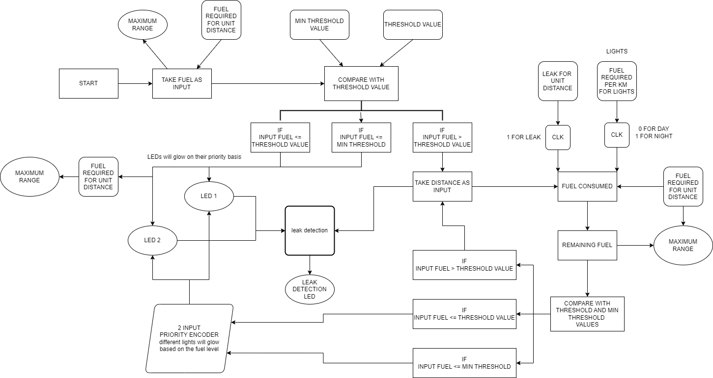

# Digital Fuel Gauge with Advanced Monitoring Features
<!-- First Section -->
## Team Details

  
Detail

  > Semester: 3rd Sem B. Tech. CSE

  > Section: S1

  > Team ID: S1-T22

  > Member-1: Aaditya Yadav, 231CS102, aadityayadav.231cs102@nitk.edu.in

  > Member-2: Chetan Kumar Sah, 231CS118, chetankumarsah.231cs118@nitk.edu.in

  > Member-3: Girish Sharma, 231CS123, girishsharma.231cs123@nitk.edu.in

<!-- Second Section -->
## Abstract

  
Detail

  
1) Motivation: In today’s world, accurate fuel monitoring is critical for efficient vehicle operation
and cost management. Traditional fuel gauges often lack precision and additional monitoring capabilities,
leading to fuel wastage and unforeseen breakdowns. With the integration of advanced monitoring
systems, users can make informed decisions regarding fuel usage, plan refueling schedules, and reduce
costs. This project aims to explore the design and implementation of a digital fuel gauge that not only
displays the fuel level accurately but also incorporates advanced monitoring features. The motivation
stems from the need for modern solutions to improve energy management and operational efficiency in
vehicles and other machinery dependent on fuel. 
2) Problem Statement: Current analog fuel gauges provide only a rough estimation of fuel levels,
which can lead to inaccuracies and potential miscalculations, especially in critical scenarios. Furthermore,
they lack real-time advanced monitoring features such as consumption rate, low-fuel alerts, and predictive
analysis of fuel requirements. This project seeks to develop a digital fuel gauge using a digital IC trainer kit
that offers precise fuel level readings and advanced monitoring features such as low-fuel warnings,
consumption tracking, and predictive alerts. The goal is to bridge the gap between traditional fuel gauges
and modern, data-driven fuel management systems. 
3) Features: The system uses a seven-segment display to accurately represent the fuel level in either
percentage or volume. It includes real-time fuel consumption tracking, allowing users to monitor how
quickly the fuel is being used and to estimate remaining travel distance. LED indicators or buzzer sounds
are triggered when the fuel level falls below a predefined threshold, providing timely alerts to the user.
The system detects anomalies or failures in the fuel sensor, alerting the user to any sensor-related issues.
The entire system is controlled using a digital IC trainer kit, providing a flexible environment for building
and testing the design. Additional features such as GPS-based fuel consumption prediction and integration
with mobile devices can be added for real-world applications. 

## Functional Block Diagram

  
Detail

  

  > 

<!-- Third Section -->
## Working

  
Detail

  > Explain how your model works with the help of a functional table (compulsory) followed by the flowchart.

<!-- Fourth Section -->
## Logisim Circuit Diagram

  
Detail

  > Update a neat logisim circuit diagram

<!-- Fifth Section -->
## Verilog Code

  
Detail

  > Neatly update the Verilog code in code style only.

## References

  
Detail

  >https://www.electronicshub.org/different-types-sensors 
  >https://youtube.com/watch?v=5g1DzmoN6uo 
  >https://www.quora.com/search?q=digital%20fuel%20gauge%20by%20using%20digital%20electronics 
  >https://nevonprojects.com/digital-electronics-projects 
  >https://instrumentationtools.com/top-100-digital-electronics-project-ideas/ 

