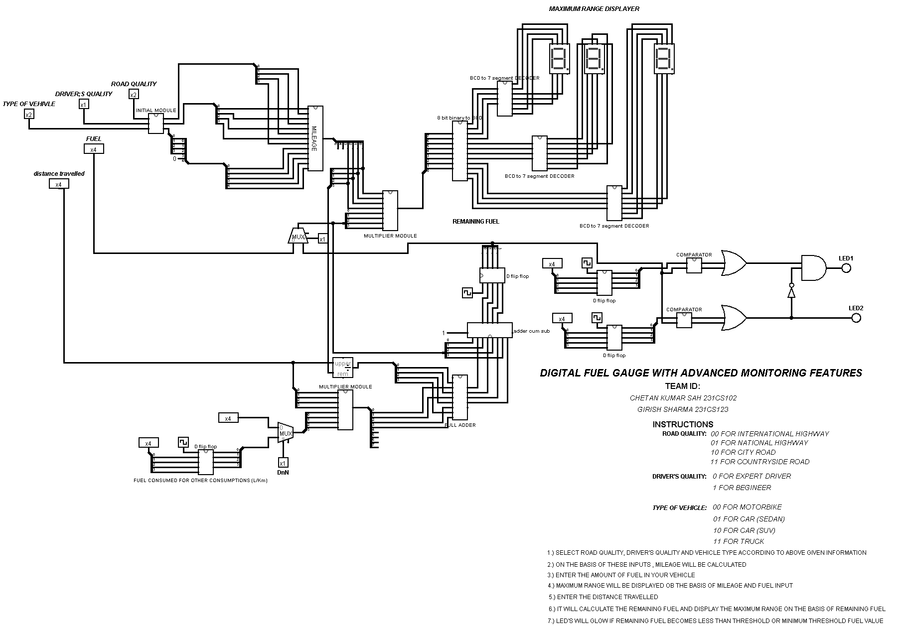
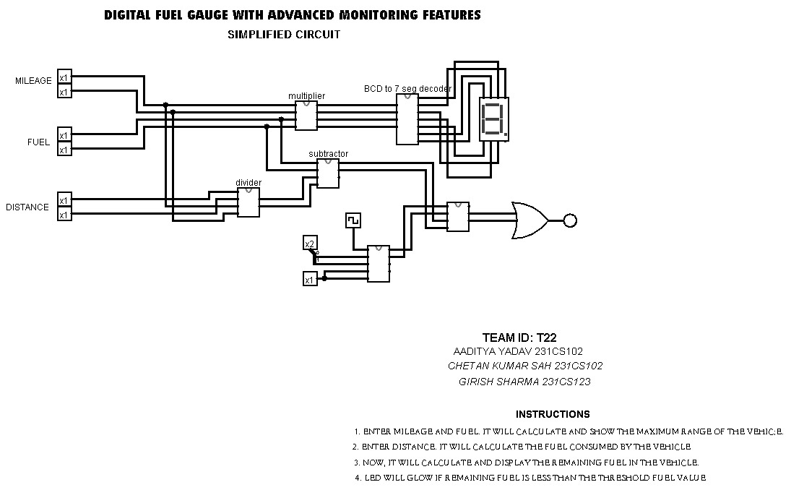

# Digital Fuel Gauge with Advanced Monitoring Features
<!-- First Section -->
## Team Details
<details>
  <summary>Detail</summary>
  

  > Semester: 3rd Sem B. Tech. CSE

  > Section: S1

  > Team ID: S1-T22

  > Member-1: Aaditya Yadav, 231CS102, aadityayadav.231cs102@nitk.edu.in

  > Member-2: Chetan Kumar Sah, 231CS118, chetankumarsah.231cs118@nitk.edu.in

  > Member-3: Girish Sharma, 231CS123, girishsharma.231cs123@nitk.edu.in

</details>

<!-- Second Section -->
## Abstract
<details>
  <summary>Detail</summary>
  
1) Motivation: In today’s world, accurate fuel monitoring is critical for efficient vehicle operation
and cost management. Traditional fuel gauges often lack precision and additional monitoring capabilities,
leading to fuel wastage and unforeseen breakdowns. With the integration of advanced monitoring
systems, users can make informed decisions regarding fuel usage, plan refueling schedules, and reduce
costs. This project aims to explore the design and implementation of a digital fuel gauge that not only
displays the fuel level accurately but also incorporates advanced monitoring features. The motivation
stems from the need for modern solutions to improve energy management and operational efficiency in
vehicles and other machinery dependent on fuel.</br>
2) Problem Statement: Current analog fuel gauges provide only a rough estimation of fuel levels,
which can lead to inaccuracies and potential miscalculations, especially in critical scenarios. Furthermore,
they lack real-time advanced monitoring features such as consumption rate, low-fuel alerts, and predictive
analysis of fuel requirements. This project seeks to develop a digital fuel gauge using a digital IC trainer kit
that offers precise fuel level readings and advanced monitoring features such as low-fuel warnings,
consumption tracking, and predictive alerts. The goal is to bridge the gap between traditional fuel gauges
and modern, data-driven fuel management systems.</br>
3) Features:
•  The system uses a seven-segment display to accurately represent the fuel level, which can be
shown either as a percentage or as a volume measurement.
• It includes real-time tracking of fuel consumption, allowing users to monitor the rate of fuel
usage and estimate the remaining travel distance based on current fuel levels.
• LED indicators or buzzer alarms are triggered when the fuel level falls below predefined thresholds, providing timely alerts to the user about low fuel levels.
• The system calculates the maximum ranges for different vehicle, road, and driver conditions,
considering various mileage scenarios.
• It also tracks the total fuel consumed across multiple cycles, offering comprehensive information
on fuel usage patterns.
• Additional features, such as GPS-based predictions of fuel consumption and integration with
mobile devices, can be incorporated for real-world applications to enhance user convenience
and functionality.</br>

</details>

## Functional Block Diagram
<details>
  <summary>Detail</summary>
  
 


</details>

<!-- Third Section -->
## Working
<details>
  <summary>Detail</summary>
  
  

  


    
1. Fuel Input Module:-
- This module takes the initial fuel input, which represents the amount of fuel present at the beginning
of a driving cycle.
- From the second cycle onwards, it accepts the remaining fuel from the previous cycle as the new
input. This allows the system to maintain continuity and provide an accurate real-time measurement
of fuel levels.
- It can handle various input types based on user configurations, making it flexible for different
scenarios.
2. Mileage Calculation Module:-
- Calculates the effective mileage of the vehicle by considering several parameters such as vehicle
type, road condition, and driving style.
- It helps in determining the amount of fuel consumed during each cycle by multiplying the distance
travelled by the fuel efficiency under specific conditions.
- The module is responsible for updating the mileage for subsequent calculations, ensuring accurate
tracking over multiple cycles.

3. Fuel Consumption Tracker:-
- Monitors the real-time fuel consumption throughout the operation, providing an estimate of how
much fuel has been used at any point.
- This module interacts with the mileage calculation module to determine the rate of fuel consumption
and updates the remaining fuel accordingly.
- It ensures that the system accurately tracks and updates the remaining fuel after each cycle.
4. Range Estimator:-
- Based on the current fuel level and effective mileage, this module calculates the maximum range
the vehicle can cover with the available fuel.
- It dynamically adjusts the range estimation depending on factors such as changes in driving conditions,
providing real-time insights into how far the vehicle can travel.
- This allows drivers to plan their journeys better, ensuring they refuel in a timely manner.
5. LED Indicator Control Module:-
- Manages the operation of two LED indicators that alert users when the fuel reaches certain critical
levels:
- LED 1: Glows when the remaining fuel is less than or equal to 5L but greater than 2L, indicating
a low fuel alert.
- LED 2: Glows when the remaining fuel is less than or equal to 2L, indicating a critical fuel level.
- Ensures users receive timely alerts and can act before running out of fuel.
6. Seven-Segment Display Controller:-
- Controls the visual representation of the fuel level on a seven-segment display, allowing users to
see the current fuel status at a glance.
- Converts the digital value of the remaining fuel into a format that can be displayed either as a
volume (e.g., liters) or as a percentage.
- Enhances user experience by providing clear, easy-to-read information.
7. Condition-Based Adaptation Module:-
- This module adjusts the fuel consumption and range estimation calculations based on different
conditions, including:
- Vehicle Condition: Adjusts the mileage according to the type and efficiency of the vehicle.
- Road Condition: Considers whether the driving is on highways, city roads, or rough terrains, influencing
the fuel consumption rates.
- Driver Behaviour: Adapts calculations based on driving patterns (aggressive, normal, or fuelefficient
driving).
- It ensures that the fuel gauge system provides realistic estimates and adapts dynamically to various
driving scenarios.
3 Equations Involved
3.1 Mileage Calculation
The mileage is calculated based on three factors:
• Road Quality
• Driver Quality
• Vehicle Quality
The resulting mileage is an average of these three calculated values.
3.1.1 Mileage Equations
Mileage based on road quality (mileage1):
mileage1 =


12, if road quality = 00 (good road condition)
9, if road quality = 01 (moderate road condition)
6, if road quality = 10 (poor road condition)
3, if road quality = 11 (very poor road condition)
Mileage based on driver quality (mileage2):
mileage2 =
(
12, if driver quality = 0 (efficient driver)
6, if driver quality = 1 (inefficient driver)

Mileage based on vehicle quality (mileage3):
mileage3 =


12, if vehicle quality = 00 (best condition)
9, if vehicle quality = 01 (good condition)
6, if vehicle quality = 10 (average condition)
3, if vehicle quality = 11 (poor condition)
Average mileage (mileage):
mileage =
mileage1 + mileage2 + mileage3
3
3.2 Total Fuel Consumption Calculation
Fuel consumption is determined by the distance covered and the calculated mileage. Additional
fixed fuel consumption for headlights is also added.
Equation for total fuel consumption:
total fuel consumed =

distance
mileage

+ fuel headlights
Where:
• fuel headlights = 1 (fixed consumption per cycle)
• If mileage > 0, fuel consumption depends on the distance/mileage ratio plus fuel headlights.
• If mileage = 0, total fuel consumed is set to 0 to avoid any division errors.
3.3 Remaining Fuel Calculation
The remaining fuel is determined by subtracting the total fuel consumed from the input fuel for
that cycle.
Equation for remaining fuel:
remaining fuel = input fuel − total fuel consumed
If input fuel < total fuel consumed, remaining fuel is set to 0 to ensure it doesn’t go negative.
3.4 LED Control Logic
There are two LEDs that provide a visual indication of the fuel level:
• LED1: Activates when fuel is low but not critical (2 < remaining fuel ≤ 5)
• LED2: Activates when fuel is critically low (remaining fuel < 2)
LED Equations:
LED1 = 1 if (remaining fuel ≤ 5) ∧ (remaining fuel > 2)
LED2 = 1 if (remaining fuel < 2)
These conditions can be logically represented as:
LED1 = (remaining fuel ≤ 5) ∧ (remaining fuel > 2)
LED2 = (remaining fuel < 2)

3.5 Explanation of Execution Flow
1. Inputs are taken: Based on input fuel, distance, road quality, vehicle quality, and driver quality.
2. Mileage is calculated: Depending on conditions, the mileage is computed.
3. Fuel Consumption: With the given mileage and distance, the total fuel consumed is calculated.
4. Remaining Fuel: Based on input fuel, remaining fuel is updated for the next cycle.
5. LED Indicator: Based on remaining fuel, LED1 and LED2 are activated or deactivated.
</details>

## Design

<details>
  <summary>Detail</summary>
  
</br>
</br>
1. Fuel Input Module</br>
Purpose: This module is responsible for initializing and updating the fuel input at the beginning of each driving cycle.</br>
Operation:</br>
Initial Fuel Input: Accepts an initial fuel value at the start of the system or journey.</br>
Cycle Continuity: From the second cycle onwards, it takes the remaining fuel from the previous cycle as input, enabling seamless tracking of fuel levels across cycles.</br>
Flexibility: Configurable to handle various input types, such as liters or percentages, depending on user requirements.</br>
Output: Provides the current fuel level to be used in subsequent calculations.</br>
  </br>
2. Mileage Calculation Module</br>
Purpose: Calculates the vehicle’s effective mileage based on conditions to ensure realistic fuel consumption tracking.</br>
Operation:</br>
Dynamic Calculation: Factors in parameters such as vehicle type, road conditions, and driving style (e.g., aggressive or conservative driving).
Mileage Adjustment: Continuously updates mileage values to reflect varying conditions, ensuring accuracy in fuel tracking.
Fuel Efficiency Update: Adjusts fuel efficiency for each cycle based on the current conditions, impacting fuel consumption calculations.</br>
Output: Provides an updated mileage value for fuel consumption estimation.</br>
  </br>
3. Fuel Consumption Tracker</br>
Purpose: Tracks the amount of fuel consumed during the operation in real time.</br>
Operation:</br>
Real-Time Monitoring: Calculates the fuel consumed in each cycle by dividing the distance traveled by the current mileage.</br>
Interaction with Mileage Module: Fetches the effective mileage to accurately determine the fuel rate, adjusting for consumption patterns.</br>
Updating Remaining Fuel: Subtracts consumed fuel from the total fuel, updating the fuel level for the next cycle.</br>
Output: Feeds the updated remaining fuel level back to the Fuel Input Module for continuity.</br>
  </br>
4. Range Estimator</br>
Purpose: Calculates the maximum distance the vehicle can cover with the remaining fuel.</br>
Operation:</br>
Dynamic Range Calculation: Uses current fuel level and mileage to estimate how far the vehicle can travel.</br>
Adjustments: Continuously updates the estimated range as fuel level and conditions change, providing real-time insights for trip planning.</br>
Output: Displays the maximum range on the seven-segment display, aiding drivers in planning refueling stops.</br>
  </br>
5. LED Indicator Control Module</br>
Purpose: Manages alerts for fuel levels to inform the user when fuel is low or critically low.</br>
Operation:</br>
Threshold Comparison: Compares remaining fuel against predefined thresholds.</br>
LED Control:</br>
Critical Alert (2L or less): Activates a single LED to indicate a critical fuel level when the remaining fuel falls to or below 2 liters.</br>
Output: Controls the LED state based on fuel level to give the driver timely alerts for refueling.</br>
  </br>
6. Seven-Segment Display Controller</br>
Purpose: Converts digital fuel data into a visual format on a seven-segment display.</br>
Operation:</br>
Data Conversion: Transforms the fuel level or maximum range into a displayable value on the seven-segment screen, either in liters or as a percentage.</br>
User Experience: Provides a clear and user-friendly display of fuel status, making it easy for the driver to interpret fuel levels at a glance.</br>
Output: Drives the seven-segment display to show real-time fuel status.</br>
Each module plays a crucial role in ensuring an accurate, real-time tracking and display of fuel status, allowing drivers to stay informed and respond appropriately to fuel alerts. This modular approach also enhances the system’s flexibility and adaptability to various user scenarios and driving conditions.</br>
  </br>
</details>

<!-- Fourth Section -->
## Logisim Circuit Diagram
<details>
  <summary>Detail</summary>
  The provided Logisim design for a DigitalFuelGauge simulates a vehicle’s fuel management system,
integrating various components to process inputs such as fuel level, distance traveled, and vehicle,
road, and driver quality metrics. The design utilizes combinational logic to calculate the mileage
based on these inputs, with specific conditions defined for each quality metric to determine the overall efficiency. The total fuel consumed is computed based on the calculated mileage and distance,
ensuring that the remaining fuel does not fall below zero. Two LED indicators are implemented to
signal different fuel level thresholds, providing visual alerts for low and critical fuel states. The overall structure is organized for clarity, with distinct functional blocks for input handling, calculations,
and output displays, enabling easy analysis and modifications for further enhancements.


  
  </br>

  
  <details>
    <summary>MAIN CIRCUIT</summary>
    
   

    
  </details>
  <details>
    <summary>INITIAL MODULE</summary>
    


</details>
  <details>
    <summary>MILEAGE MODULE</summary>
    
  


  </details>
  <details>
    <summary>COMPONENTS</summary>

  


   

  

  

  

  

  

  


  </details>

</details>

<!-- Fifth Section -->
## Verilog Code
<details>
  <summary>Detail</summary>

  The provided Verilog code implements a DigitalFuelGauge module that simulates a vehicle’s fuel management system, taking into account inputs such as clock, reset, fuel quantity, distance traveled,
and various quality metrics for the vehicle, road, and driver. It calculates the mileage based on these inputs using case statements and averages the results, then computes the total fuel consumed during
a travel cycle while ensuring that the remaining fuel is not negative. The module also includes
logic to control two LED indicators based on fuel levels, signaling low and critical fuel statuses.
Accompanying this module is a testbench that initializes the inputs, generates a clock signal, and systematically tests the functionality of the DigitalFuelGauge by varying input parameters and
monitoring outputs, providing formatted results for each test cycle. This design is modular and
clear, facilitating easy understanding and potential modifications.


```
//Design of Digital Systems Mini Project
//S1_T22
//DIGITAL FUEL GAUGE WITH ADVANCED MONITORING FEATURES
//Semester: 3rd Sem B. Tech. CSE
//Member-1: Aaditya Yadav, 231CS102, aadityayadav.231cs102@nitk.edu.in
//Member-2: Chetan Kumar Sah, 231CS118, chetankumarsah.231cs118@nitk.edu.in
//Member-3: Girish Sharma, 231CS123, girishsharma.231cs123@nitk.edu.in

//Gate level implementation
// Main Module: Digital Fuel Gauge System
module Main_Module(
    input clk,
    input reset,
    input [4:0] input_fuel,
    input [3:0] distance,
    input [1:0] vehicle_quality,
    input [1:0] road_quality,
    input driver_quality,
    output reg LED1,
    output reg LED2,
    output reg [4:0] remaining_fuel,
    output reg [7:0] mileage,
    output reg [4:0] fuel_headlights,
    output reg [4:0] total_fuel_consumed,
    output reg [15:0] max_range
);

    // Internal signals
    wire [7:0] mileage1;            // Component for mileage based on road quality
    wire [7:0] mileage2;            // Component for mileage based on driver quality
    wire [7:0] mileage3;            // Component for mileage based on vehicle quality
    wire [7:0] sum_mileage;         // Component for summing mileage
    wire [7:0] avg_mileage;         // Mileage Module: for calculating average mileage
    wire [4:0] fuel_used;           // Component to hold the used fuel amount
    wire [4:0] temp_remaining_fuel; // Component to store temporary remaining fuel
    wire reset_n;                   // Component for active low reset signal

    // Component: Inverting the reset signal
    wire nreset;
    not u_reset_inv(nreset, reset);

    // Gate-Level Implementation of 4x1 Multiplexer for Road Quality
module mux4x1_gate_level (
    input [1:0] sel,
    input [7:0] in0,
    input [7:0] in1,
    input [7:0] in2,
    input [7:0] in3,
    output [7:0] out
);
    wire [7:0] and0, and1, and2, and3;
    wire not_sel0, not_sel1;

    // Generate NOT gates for the select signals
    not g1(not_sel0, sel[0]);
    not g2(not_sel1, sel[1]);

    // AND gates to select the appropriate input based on sel
    and g3[7:0] (and0, in0, {8{not_sel1 & not_sel0}});  // Select in0 if sel = 00
    and g4[7:0] (and1, in1, {8{not_sel1 & sel[0]}});   // Select in1 if sel = 01
    and g5[7:0] (and2, in2, {8{sel[1] & not_sel0}});   // Select in2 if sel = 10
    and g6[7:0] (and3, in3, {8{sel[1] & sel[0]}});     // Select in3 if sel = 11

    // OR gates to combine all possible outputs
    or g7[7:0] (out, and0, and1, and2, and3);
endmodule

    // Initial Module: Driver quality mileage calculation
    wire n_driver_quality;
    not u_driver_quality_inv(n_driver_quality, driver_quality);
    and u_driver_quality_out(mileage2[0], n_driver_quality, 8'b00001100);
    and u_driver_quality_out1(mileage2[1], driver_quality, 8'b00000110);
    or u_driver_quality_final(mileage2[7:2], mileage2[0], mileage2[1]);  

    // Gate-Level Implementation of 4x1 Multiplexer for Vehicle Quality
module mux4x1_gate_level_vehicle (
    input [1:0] sel,
    input [7:0] in0,
    input [7:0] in1,
    input [7:0] in2,
    input [7:0] in3,
    output [7:0] out
);
    wire [7:0] and0, and1, and2, and3;
    wire not_sel0, not_sel1;

    // Generate NOT gates for the select signals
    not g1(not_sel0, sel[0]);
    not g2(not_sel1, sel[1]);

    // AND gates to select the appropriate input based on sel
    and g3[7:0] (and0, in0, {8{not_sel1 & not_sel0}});  // Select in0 if sel = 00
    and g4[7:0] (and1, in1, {8{not_sel1 & sel[0]}});   // Select in1 if sel = 01
    and g5[7:0] (and2, in2, {8{sel[1] & not_sel0}});   // Select in2 if sel = 10
    and g6[7:0] (and3, in3, {8{sel[1] & sel[0]}});     // Select in3 if sel = 11

    // OR gates to combine all possible outputs
    or g7[7:0] (out, and0, and1, and2, and3);
endmodule


    // Component: Sum of mileage components
    wire [7:0] temp_sum_mileage;
    four_bit_adder sum_mileage_adder(.a(mileage1[3:0]), .b(mileage2[3:0]), .sum(temp_sum_mileage[3:0]));
    four_bit_adder sum_mileage_adder2(.a(temp_sum_mileage[3:0]), .b(mileage3[3:0]), .sum(sum_mileage[3:0]));

    module avg_mileage_gate_level (
    input [7:0] sum_mileage,
    output [7:0] avg_mileage
);
    wire [7:0] avg_mileage_temp;

    // First right shift (sum_mileage >> 1)
    and (avg_mileage_temp[0], sum_mileage[1], 1'b1); 
    and (avg_mileage_temp[1], sum_mileage[2], 1'b1); 
    and (avg_mileage_temp[2], sum_mileage[3], 1'b1); 
    and (avg_mileage_temp[3], sum_mileage[4], 1'b1); 
    and (avg_mileage_temp[4], sum_mileage[5], 1'b1); 
    and (avg_mileage_temp[5], sum_mileage[6], 1'b1); 
    and (avg_mileage_temp[6], sum_mileage[7], 1'b1); 
    and (avg_mileage_temp[7], 1'b0, 1'b1);           

    // Second right shift (avg_mileage_temp >> 1)
    and (avg_mileage[0], avg_mileage_temp[1], 1'b1); 
    and (avg_mileage[1], avg_mileage_temp[2], 1'b1); 
    and (avg_mileage[2], avg_mileage_temp[3], 1'b1); 
    and (avg_mileage[3], avg_mileage_temp[4], 1'b1); 
    and (avg_mileage[4], avg_mileage_temp[5], 1'b1); 
    and (avg_mileage[5], avg_mileage_temp[6], 1'b1); 
    and (avg_mileage[6], avg_mileage_temp[7], 1'b1); 
    and (avg_mileage[7], 1'b0, 1'b1);             
endmodule

    // Component: Calculate total fuel consumption: distance / avg_mileage
    module distance_transfer_gate_level (
    input [3:0] distance,
    output [3:0] distance_temp
);

    // Connect each bit of distance directly to distance_temp using AND gates
    and (distance_temp[0], distance[0], 1'b1); 
    and (distance_temp[1], distance[1], 1'b1); 
    and (distance_temp[2], distance[2], 1'b1); 
    and (distance_temp[3], distance[3], 1'b1); 
endmodule
 

    // Component: Logic for division
    wire [4:0] temp_fuel_used;
    divide_by_mileage divider(.dividend(distance_temp), .divisor(avg_mileage), .quotient(temp_fuel_used));

    // Component: Calculate remaining fuel
    wire [4:0] temp_remaining_fuel_full;
    remaining_fuel_calculator fuel_calculator(.input_fuel(input_fuel), .fuel_used(temp_fuel_used), .remaining_fuel(temp_remaining_fuel_full));

    // LED indicators based on remaining fuel
    module LED_Indicator_Gates (
    input [4:0] remaining_fuel,
    output LED1,
    output LED2
);
    wire n_rfuel_4, n_rfuel_3, n_rfuel_2, n_rfuel_1, n_rfuel_0;
    wire comp1, comp2, comp3, comp4, comp5, comp6, comp7;
    wire led1_intermediate, led2_intermediate;

    // Generate NOT gates for each bit of `remaining_fuel`
    not (n_rfuel_4, remaining_fuel[4]);
    not (n_rfuel_3, remaining_fuel[3]);
    not (n_rfuel_2, remaining_fuel[2]);
    not (n_rfuel_1, remaining_fuel[1]);
    not (n_rfuel_0, remaining_fuel[0]);

    // Logic for LED1: Turn ON if 3 <= `remaining_fuel` <= 5
    and (comp1, n_rfuel_4, n_rfuel_3, remaining_fuel[2], remaining_fuel[1], n_rfuel_0); // 3
    and (comp2, n_rfuel_4, n_rfuel_3, remaining_fuel[2], remaining_fuel[1], remaining_fuel[0]); // 4
    and (comp3, n_rfuel_4, remaining_fuel[3], n_rfuel_2, n_rfuel_1, n_rfuel_0); // 5
    or (led1_intermediate, comp1, comp2, comp3);
    buf (LED1, led1_intermediate);

    // Logic for LED2: Turn ON if `remaining_fuel` < 2
    and (comp4, n_rfuel_4, n_rfuel_3, n_rfuel_2, n_rfuel_1, n_rfuel_0); // 0
    and (comp5, n_rfuel_4, n_rfuel_3, n_rfuel_2, n_rfuel_1, remaining_fuel[0]); // 1
    or (led2_intermediate, comp4, comp5);
    buf (LED2, led2_intermediate);
endmodule

// Component: Mux definition (2-to-1 multiplexer)
module mux2x1_gates (
    input [1:0] sel,
    input [7:0] in0,
    input [7:0] in1,
    input [7:0] in2,
    input [7:0] in3,
    output [7:0] out
);
    wire [7:0] sel_00, sel_01, sel_10, sel_11;
    wire n_sel0, n_sel1;

    // NOT gates
    not (n_sel0, sel[0]);
    not (n_sel1, sel[1]);

    // AND gates for each case
    and (sel_00[0], in0[0], n_sel1, n_sel0);
    and (sel_01[0], in1[0], n_sel1, sel[0]);
    and (sel_10[0], in2[0], sel[1], n_sel0);
    and (sel_11[0], in3[0], sel[1], sel[0]);
    or (out[0], sel_00[0], sel_01[0], sel_10[0], sel_11[0]);

    // Repeat for other bits
    genvar i;
    generate
        for (i = 1; i < 8; i = i + 1) begin: mux_gates_loop
            and (sel_00[i], in0[i], n_sel1, n_sel0);
            and (sel_01[i], in1[i], n_sel1, sel[0]);
            and (sel_10[i], in2[i], sel[1], n_sel0);
            and (sel_11[i], in3[i], sel[1], sel[0]);
            or (out[i], sel_00[i], sel_01[i], sel_10[i], sel_11[i]);
        end
    endgenerate
endmodule

// Component: 4-bit Adder using gates
module full_adder_gates (
    input a, 
    input b, 
    input cin, 
    output sum, 
    output cout
);
    wire w1, w2, w3;

    xor (w1, a, b);
    xor (sum, w1, cin);
    and (w2, a, b);
    and (w3, w1, cin);
    or (cout, w2, w3);
endmodule

module four_bit_adder_gates (
    input [3:0] a, 
    input [3:0] b, 
    input cin, 
    output [3:0] sum, 
    output cout
);
    wire c1, c2, c3; 

    full_adder_gates fa0 (.a(a[0]), .b(b[0]), .cin(cin), .sum(sum[0]), .cout(c1));
    full_adder_gates fa1 (.a(a[1]), .b(b[1]), .cin(c1), .sum(sum[1]), .cout(c2));
    full_adder_gates fa2 (.a(a[2]), .b(b[2]), .cin(c2), .sum(sum[2]), .cout(c3));
    full_adder_gates fa3 (.a(a[3]), .b(b[3]), .cin(c3), .sum(sum[3]), .cout(cout));
endmodule


// Component: Divider module (simple integer division)
module comparator_gates (
    input [7:0] A, 
    input [7:0] B, 
    output greater_or_equal
);
    wire [7:0] diff;
    wire borrow;
    
    subtractor_8bit_gates sub_comp (.a(A), .b(B), .diff(diff), .borrow(borrow));
    
    // If `borrow` is 0, A >= B, else A < B
    not (greater_or_equal, borrow);
endmodule
module full_subtractor (
    input a, 
    input b, 
    input bin, 
    output diff, 
    output bout
);
    wire w1, w2, w3;
    
    xor (w1, a, b);
    xor (diff, w1, bin);
    and (w2, ~a, b);
    and (w3, ~w1, bin);
    or (bout, w2, w3);
endmodule

module subtractor_8bit_gates (
    input [7:0] a, 
    input [7:0] b, 
    output [7:0] diff, 
    output borrow
);
    wire [7:0] borrows;
    
    full_subtractor fs0 (.a(a[0]), .b(b[0]), .bin(0), .diff(diff[0]), .bout(borrows[0]));
    full_subtractor fs1 (.a(a[1]), .b(b[1]), .bin(borrows[0]), .diff(diff[1]), .bout(borrows[1]));
    full_subtractor fs2 (.a(a[2]), .b(b[2]), .bin(borrows[1]), .diff(diff[2]), .bout(borrows[2]));
    full_subtractor fs3 (.a(a[3]), .b(b[3]), .bin(borrows[2]), .diff(diff[3]), .bout(borrows[3]));
    full_subtractor fs4 (.a(a[4]), .b(b[4]), .bin(borrows[3]), .diff(diff[4]), .bout(borrows[4]));
    full_subtractor fs5 (.a(a[5]), .b(b[5]), .bin(borrows[4]), .diff(diff[5]), .bout(borrows[5]));
    full_subtractor fs6 (.a(a[6]), .b(b[6]), .bin(borrows[5]), .diff(diff[6]), .bout(borrows[6]));
    full_subtractor fs7 (.a(a[7]), .b(b[7]), .bin(borrows[6]), .diff(diff[7]), .bout(borrow));
endmodule
module divide_by_mileage_gates (
    input [3:0] dividend,
    input [7:0] divisor,
    output [4:0] quotient
);
    wire [7:0] temp_dividend;
    wire [7:0] shifted_dividend;
    wire greater_equal, diff_borrow;
    wire [7:0] diff;
    
    // Shift dividend left to match with divisor
    module shift_left_dividend_gate_level (
    input [3:0] dividend,
    output [7:0] temp_dividend
);

    // Set the lower 4 bits of temp_dividend to 0
    and (temp_dividend[0], 1'b0, 1'b0);
    and (temp_dividend[1], 1'b0, 1'b0);
    and (temp_dividend[2], 1'b0, 1'b0);
    and (temp_dividend[3], 1'b0, 1'b0);

    // Pass the 4-bit dividend to the upper 4 bits of temp_dividend
    and (temp_dividend[4], dividend[0], 1'b1);
    and (temp_dividend[5], dividend[1], 1'b1);
    and (temp_dividend[6], dividend[2], 1'b1);
    and (temp_dividend[7], dividend[3], 1'b1);

endmodule

    
    // Compare and subtract if greater or equal
    comparator_gates comp (.A(temp_dividend), .B(divisor), .greater_or_equal(greater_equal));
    subtractor_8bit_gates sub (.a(temp_dividend), .b(divisor), .diff(diff), .borrow(diff_borrow));
    
endmodule

```

```
//Design of Digital Systems Mini Project
//S1_T22
//DIGITAL FUEL GAUGE WITH ADVANCED MONITORING FEATURES
//Semester: 3rd Sem B. Tech. CSE
//Member-1: Aaditya Yadav, 231CS102, aadityayadav.231cs102@nitk.edu.in
//Member-2: Chetan Kumar Sah, 231CS118, chetankumarsah.231cs118@nitk.edu.in
//Member-3: Girish Sharma, 231CS123, girishsharma.231cs123@nitk.edu.in


//Behavioral Level Implementation
module DigitalFuelGauge(
    input clk,               // Clock Signal
    input reset,             // To reset the system
    input [4:0] input_fuel,   // Input fuel in liters (5-bit wide to accommodate up to 31L)
    input [3:0] distance,     // Distance covered by the vehicle 
    input [1:0] vehicle_quality, // Vehicle quality 
    input [1:0] road_quality,    // Road quality 
    input driver_quality,     // Driver quality
    output reg LED1,          // LED1 indicator for fuel warning when fuel is lower than threshold value
    output reg LED2,          // LED2 indicator for fuel warning when fuel is lower than min threshold value
    output reg [4:0] remaining_fuel, // Output of remaining fuel
    output reg [7:0] mileage,        //  Calculated mileage
    output reg [4:0] fuel_headlights,//  Fuel consumed by headlights
    output reg [4:0] total_fuel_consumed // Total fuel consumed in a cycle
);

    // Constants for mileage calculations
    parameter MIN_THRESHOLD = 2; // Minimum threshold for fuel; below this, system signals low fuel
    parameter FUEL_HEADLIGHTS = 1; // Fuel consumption for headlights

    // Internal variables for mileage calculations
    reg [7:0] mileage1; // Mileage based on road quality 
    reg [7:0] mileage2; // Mileage based on driver quality
    reg [7:0] mileage3; // Mileage based on vehicle quality

    // AlwaysExecuted at every clock cycle or when reset signal is activated
    always @(posedge clk or posedge reset) begin
        if (reset) begin
            remaining_fuel <= 0;        // Reset remaining fuel to zero
            mileage <= 0;               // Reset mileage calculation
            fuel_headlights <= 0;       // Reset fuel consumed by headlights
            total_fuel_consumed <= 0;   // Reset total fuel consumed value
        end else begin
            // Calculate mileage based on road quality
            case (road_quality)
                2'b00: mileage1 = 12;   // Good road quality gives the best mileage
                2'b01: mileage1 = 9;    // Moderate road quality (75% of the best mileage)
                2'b10: mileage1 = 6;    // Poor road quality (half the best mileage)
                2'b11: mileage1 = 3;    // Very poor road quality (quarter of the best mileage)
             
            endcase

            // Calculate mileage based on driver quality
            mileage2 = (driver_quality == 1'b0) ? 12 : 6;

            // Calculate mileage based on vehicle quality using another case statement
            case (vehicle_quality)
                2'b00: mileage3 = 12;   // Best vehicle condition gives maximum mileage
                2'b01: mileage3 = 9;    // Decent vehicle condition (75% of maximum mileage)
                2'b10: mileage3 = 6;    // Average vehicle condition (half of maximum mileage)
                2'b11: mileage3 = 3;    // Poor vehicle condition (quarter of maximum mileage)
          
            endcase

            // Average the three mileage values to get a final mileage estimate
            mileage = (mileage1 + mileage2 + mileage3) / 3;

            // Calculate the total fuel consumption using distance and mileage
            if (mileage > 0) begin
                total_fuel_consumed = (distance / mileage) + FUEL_HEADLIGHTS;
                // Ensure remaining fuel does not go negative
                remaining_fuel = (input_fuel >= total_fuel_consumed) ? (input_fuel - total_fuel_consumed) : 0;
            end else begin
                total_fuel_consumed = 0; // No fuel consumed if mileage is zero
                remaining_fuel = input_fuel; // Retain input fuel if no consumption
            end

            // Fixed fuel consumption by headlights
            fuel_headlights = FUEL_HEADLIGHTS;
        end
    end

    // LED Control Logic
    always @(posedge clk) begin
        if (remaining_fuel <= 5 && remaining_fuel > 2) begin
            LED1 = 1; // Activate LED1 if fuel is low
            LED2 = 0; // Ensure LED2 remains off
        end 
        else if (remaining_fuel < 2) begin
            LED1 = 0; // Deactivate the LED1
            LED2 = 1; // Activate LED2 forlow fuel warning i.e less than min threshold value
        end 
        else begin
            LED1 = 0; // Deactivate both LEDs if fuel levels are safe
            LED2 = 0;
        end
    end

endmodule

```

```
//Design of Digital Systems Mini Project
//S1_T22
//DIGITAL FUEL GAUGE WITH ADVANCED MONITORING FEATURES
//Semester: 3rd Sem B. Tech. CSE
//Member-1: Aaditya Yadav, 231CS102, aadityayadav.231cs102@nitk.edu.in
//Member-2: Chetan Kumar Sah, 231CS118, chetankumarsah.231cs118@nitk.edu.in
//Member-3: Girish Sharma, 231CS123, girishsharma.231cs123@nitk.edu.in


//Testbench File
module DigitalFuelGauge_tb;

    // Inputs for the DigitalFuelGauge
    reg clk;                     // Clock signal 
    reg reset;                   // Reset signal
    reg [4:0] input_fuel;        // Input fuel quantity 
    reg [3:0] distance;          // Distance covered 
    reg [1:0] vehicle_quality;   // Vehicle quality
    reg [1:0] road_quality;      // Road quality 
    reg driver_quality;          // Driver quality

    // Outputs to monitor from the DigitalFuelGauge
    wire LED1;                   // Threshold fuel LED1
    wire LED2;                   // Min threshold fuel LED2
    wire [4:0] remaining_fuel;   // Remaining fuel register 
    wire [7:0] mileage;          // Mileage calculation register 
    wire [4:0] fuel_headlights;  // Fuel consumed by headlights (1L)
    wire [4:0] total_fuel_consumed; // Total fuel consumption register
     
    // Instantiate the gate-level implementation for testing
/*DigitalFuelGauge_GateLevel uut_G (
        .clk(clk),
        .reset(reset),
        .input_fuel(input_fuel),
        .distance(distance),
        .vehicle_quality(vehicle_quality),
        .road_quality(road_quality),
        .driver_quality(driver_quality),
        .LED1(LED1_G),
        .LED2(LED2_G),
        .remaining_fuel(remaining_fuel_G),
        .mileage(mileage_G),
        .fuel_headlights(fuel_headlights_G),
        .total_fuel_consumed(total_fuel_consumed_G),
        .max_range(max_range_G)
    );
    */

    // Instantiate the behavioral-level implementation for testing
    DigitalFuelGauge uut (
        .clk(clk),
        .reset(reset),
        .input_fuel(input_fuel),
        .distance(distance),
        .vehicle_quality(vehicle_quality),
        .road_quality(road_quality),
        .driver_quality(driver_quality),
        .LED1(LED1),
        .LED2(LED2),
        .remaining_fuel(remaining_fuel),
        .mileage(mileage),
        .fuel_headlights(fuel_headlights),
        .total_fuel_consumed(total_fuel_consumed)
    );

    // Clock generation process to show clock behavior
    initial begin
        clk = 0; // Initial state of the clock
        forever #5 clk = ~clk; // Toggle the clock every 5 time units to simulate clock cycles
    end

    // Test scenarios setup to validate the module behavior over multiple cycles
    integer cycle; // Declare cycle counter
    reg [15:0] max_range; // Register to hold the maximum range

    initial begin
        // Start with a reset to initialize the system state and registers
        reset = 1; 
        #10; // Wait for 10 time units to allow reset
        reset = 0; // Release the reset

        // Set the initial input fuel
        input_fuel = 15; // Starting value for input fuel in liters
        distance = 0; // Initial distance is set to 0 km
        vehicle_quality = 2'b00; // Initial value for vehicle quality (best condition)
        road_quality = 2'b00; // Initial value for road quality (best condition)
        driver_quality = 1'b0; // Initial value for driver quality (efficient driver)

        // Header for the test output to be printed to the console
        $display("Cycle       | Input Fuel (L) | Distance (km) | Vehicle Quality | Road Quality  | Driver Quality | Mileage (km/L)   | Fuel Headlights (L)   | Total Fuel Consumed (L) | Remaining Fuel (L) | Max Range (km)    | LED1 | LED2");
        $display("-----------------------------------------------------------------------------------------------------------------------------------------------------------------------------------------------------------------------------");


        // Initialize the cycle counter
        cycle = 0;

        // Initial wait period before starting the test iterations
        #20; 

        // Loop until the input fuel is less than the minimum threshold
        while (input_fuel >= 2) begin
            cycle = cycle + 1; // Increment cycle counter for each iteration

            // Set distance based on mileage to ensure distance/mileage ratio is an integer
            if (mileage > 0) begin
                distance = mileage * (cycle % 4 + 1); // Adjust distance for the cycle
            end else begin
                distance = 0; // Ensure distance is zero if mileage is not defined
            end
            
            // Cycle through different values for vehicle, road, and driver qualities
            vehicle_quality = (cycle % 4); // Cycle through possible values for vehicle quality
            road_quality = (cycle % 4); // Cycle through possible values for road quality
            driver_quality = (cycle % 2); // Alternate between efficient and inefficient driver qualities
            
            #10; // Wait for a clock cycle to allow new inputs to be processed
            
            // Calculate maximum range based on input fuel and mileage
            max_range = input_fuel * mileage;

            // Display results for the current test cycle in a formatted way
            $display("%3d    | %3d           | %d             | %b              | %b            | %b              | %d              | %d                    | %d                      | %d                 | %d             | %b   | %b",
                     cycle, input_fuel, distance, vehicle_quality, road_quality, driver_quality, mileage, fuel_headlights, total_fuel_consumed, remaining_fuel, max_range, LED1, LED2);
            
            // Set input fuel for the next cycle to be the remaining fuel from the previous cycle
            input_fuel = remaining_fuel;
        end

        // Stop the simulation when input fuel falls below the minimum threshold
        $stop; // Halt the testbench operation
    end

endmodule
```
</details>

## Hardware Implementation

<details>
  <summary>Detail</summary>

> 
  In this digital fuel gauge project, the system is designed to simplify the process of fuel tracking and range estimation for a vehicle:

1.Mileage Input:</br>
The gauge directly accepts mileage as an input, representing the distance that the vehicle can travel per liter of fuel.</br>
</br>
2.Maximum Range Calculation:</br>
Using this mileage input, the gauge calculates the maximum possible range by multiplying the mileage with the current fuel level in the tank. This range value, indicating the farthest distance the vehicle can travel with the available fuel, is shown on a seven-segment display.</br>
</br>
3.Distance Input and Fuel Consumption:</br>
When the distance traveled is entered, the gauge calculates fuel consumption by dividing the distance by the mileage, determining the exact fuel consumed for that journey.</br>
</br>
4.Remaining Fuel Calculation:</br>
The system then subtracts the fuel consumed from the total fuel to calculate the remaining fuel level, updating it as the new fuel amount in the tank.</br>
</br>
5.Threshold Comparison and LED Indicator:</br>
The remaining fuel level is compared against a critical threshold of 2 liters.</br>
</br>
6.LED Indicator:</br>
Lights up if the remaining fuel is 2 liters or less, signaling that fuel is critically low.</br>
</br>
This streamlined design ensures an accurate display of the vehicle’s maximum range and remaining fuel while providing a clear, critical low-fuel alert through a single LED indicator.
  
</details>

## References
<details>
  <summary>Detail</summary>
  >https://www.electronicshub.org/different-types-sensors</br>
  >https://youtube.com/watch?v=5g1DzmoN6uo</br>
  >https://www.quora.com/search?q=digital%20fuel%20gauge%20by%20using%20digital%20electronics</br>
  >https://nevonprojects.com/digital-electronics-projects</br>
  >https://instrumentationtools.com/top-100-digital-electronics-project-ideas/</br>
</details>
